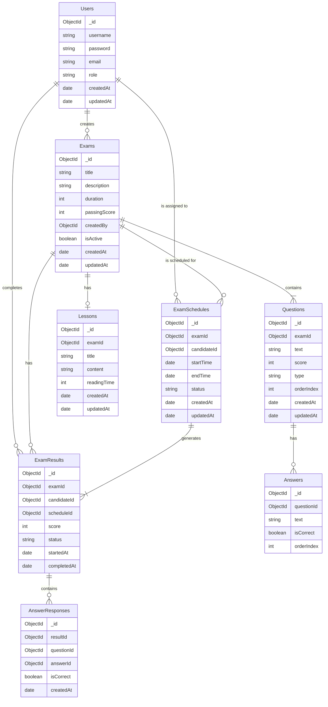

```mermaid
erDiagram
    Users ||--o{ ExamSchedules : "is assigned to"
    Users ||--o{ ExamResults : "completes"
    Users ||--o{ Exams : "creates"

    Exams ||--|{ Questions : "contains"
    Exams ||--o{ ExamSchedules : "is scheduled for"
    Exams ||--o{ ExamResults : "has"
    Exams ||--o| Lessons : "has"

    ExamSchedules ||--|{ ExamResults : "generates"

    Questions ||--o{ Answers : "has"
    ExamResults ||--o{ AnswerResponses : "contains"

    Users {
        ObjectId _id
        string username
        string password
        string email
        string role
        date createdAt
        date updatedAt
    }

    Exams {
        ObjectId _id
        string title
        string description
        int duration
        int passingScore
        ObjectId createdBy
        boolean isActive
        date createdAt
        date updatedAt
    }

    Questions {
        ObjectId _id
        ObjectId examId
        string text
        int score
        string type
        int orderIndex
        date createdAt
        date updatedAt
    }

    Answers {
        ObjectId _id
        ObjectId questionId
        string text
        boolean isCorrect
        int orderIndex
    }

    ExamSchedules {
        ObjectId _id
        ObjectId examId
        ObjectId candidateId
        date startTime
        date endTime
        string status
        date createdAt
        date updatedAt
    }

    ExamResults {
        ObjectId _id
        ObjectId examId
        ObjectId candidateId
        ObjectId scheduleId
        int score
        string status
        date startedAt
        date completedAt
    }

    AnswerResponses {
        ObjectId _id
        ObjectId resultId
        ObjectId questionId
        ObjectId answerId
        boolean isCorrect
        date createdAt
    }

    Lessons {
        ObjectId _id
        ObjectId examId
        string title
        string content
        int readingTime
        date createdAt
        date updatedAt
    }
```
