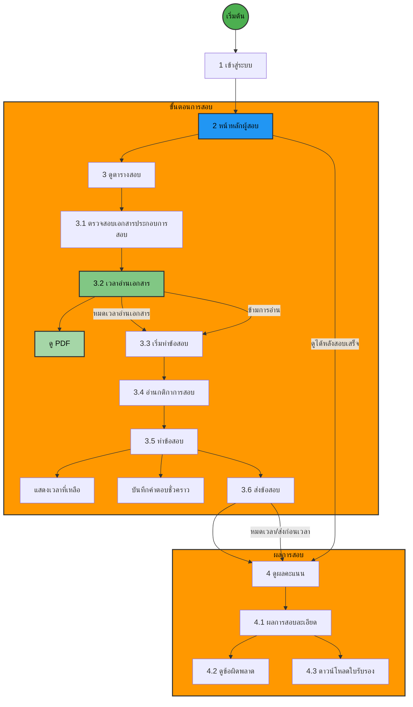

# ระบบจัดการและจัดเก็บผลข้อสอบ

---

## บทบาทแอดมิน

### ระบบจัดการข้อสอบ

ขั้นตอนการสร้างข้อสอบตั้งแต่กำหนดข้อมูลจนถึงบันทึก

### ระบบจัดการผู้สอบ

การจัดการข้อมูลผู้สอบและกำหนดตารางสอบ

### ระบบติดตามการสอบ

ตรวจสอบสถานะและความคืบหน้าของการสอบ

### ระบบรายงาน

การสร้างและส่งออกรายงานประเภทต่างๆ

```mermaid
flowchart TB
    Start((เริ่มต้น)) --> Login[เข้าสู่ระบบ Admin]
    Login --> Dashboard[หน้า Dashboard]

    %% ระบบจัดการข้อสอบ
    Dashboard --> CreateExam[1 สร้างข้อสอบใหม่]
    CreateExam-->CreateLesson[1.1 สร้างเนื้อหาบทเรียนให้เรียนก่อนสอบ]
    CreateLesson --> SetExamInfo[1.2 กำหนดข้อมูลข้อสอบ]
    SetExamInfo --> AddQuestions[1.3 เพิ่มคำถาม]
    AddQuestions --> SetAnswers[1.4 กำหนดคำตอบ]
    SetAnswers --> SetScoring[1.5 กำหนดเกณฑ์คะแนน]
    SetScoring --> SaveExam[1.6 บันทึกข้อสอบ]

    %% ระบบจัดการผู้สอบ
    SaveExam --> ManageCandidate[2 จัดการผู้สอบ]
    ManageCandidate --> AddCandidate[2.1 เพิ่มผู้สอบ]
    AddCandidate --> EditCandidate[2.2 แก้ไขข้อมูลผู้สอบ]
    EditCandidate --> AssignExam[2.3 กำหนดข้อสอบ]
    AssignExam --> SetSchedule[2.4 กำหนดตารางสอบ]

    %% ระบบติดตามการสอบ
    SetSchedule --> ExamMonitor[3 ติดตามการสอบ]
    ExamMonitor --> ActiveExams[3.1 ข้อสอบที่กำลังสอบ]
    ActiveExams --> CheckProgress[3.2 ตรวจสอบความคืบหน้า]
    CheckProgress --> ViewStatus[3.3 ดูสถานะการสอบ]

    %% ระบบรายงาน
    ViewStatus --> Reports[4 จัดการรายงาน]
    Reports --> ScoreReport[4.1 รายงานคะแนน]
    ScoreReport --> ProgressReport[4.2 รายงานความก้าวหน้า]
    ProgressReport --> StatReport[4.3 รายงานสถิติ]

    StatReport --> ExportReport[4.4 ส่งออกรายงาน]
    ExportReport --> ExportType{ประเภทการส่งออก}
    ExportType --> PDF[PDF]
    ExportType --> Excel[Excel]

    %% สไตล์
    style Start fill:#4CAF50,stroke:#333,stroke-width:2px,color:black
    style Dashboard fill:#2196F3,stroke:#333,stroke-width:2px,color:white,color:black
    style ExportType fill:#FF9800,stroke:#333,stroke-width:2px,color:black

    %% หัวข้อหลัก
    style CreateExam fill:#FFB74D,stroke:#333,stroke-width:2px,color:black
    style ManageCandidate fill:#FFB74D,stroke:#333,stroke-width:2px,color:black
    style ExamMonitor fill:#FFB74D,stroke:#333,stroke-width:2px,color:black
    style Reports fill:#FFB74D,stroke:#333,stroke-width:2px,color:black
```



---

## บทบาทผู้สอบ

### เข้าสู่ระบบ

ใช้ข้อมูลล็อกอินที่ได้รับจากแอดมิน

### หน้าหลักผู้สอบ

แสดงข้อมูลและเมนูสำหรับผู้สอบ

### ขั้นตอนการสอบ

-   ดูตารางสอบที่ถูกกำหนดไว้
-   อ่านกติกาก่อนเริ่มสอบ
-   ทำข้อสอบ (มีการแสดงเวลา)
-   ส่งข้อสอบ

### การดูผลสอบ

-   ตรวจสอบข้อผิดพลาด
-   ดูคะแนนและผลการสอบโดยละเอียด
-   ดาวน์โหลดใบรับรอง



### หมายเหตุสำหรับ AI Copilot

-   Prisma Schema

```prisma
datasource db {
  provider = "mongodb"
  url      = env("DATABASE_URL")
}

generator client {
  provider = "prisma-client-js"
}

model User {
  id            String         @id @default(auto()) @map("_id") @db.ObjectId
  username      String         @unique
  email         String         @unique
  password      String
  role          Role          @default(USER)
  firstName     String?
  lastName      String?
  createdAt     DateTime      @default(now())
  updatedAt     DateTime      @updatedAt
  examsCreated  Exam[]        @relation("ExamCreator")
  schedules     ExamSchedule[] @relation("CandidateSchedules")
  examResults   ExamResult[]   @relation("CandidateResults")
}

enum Role {
  ADMIN
  USER
}

model Exam {
  id            String         @id @default(auto()) @map("_id") @db.ObjectId
  title         String
  description   String?
  duration      Int           // in minutes
  passingScore  Int
  createdBy     String        @db.ObjectId
  isActive      Boolean       @default(true)
  createdAt     DateTime      @default(now())
  updatedAt     DateTime      @updatedAt
  creator       User          @relation("ExamCreator", fields: [createdBy], references: [id])
  questions     Question[]
  schedules     ExamSchedule[]
  results       ExamResult[]
  lesson        Lesson?
}

model Question {
  id            String         @id @default(auto()) @map("_id") @db.ObjectId
  examId        String        @db.ObjectId
  text          String
  type          QuestionType  @default(MULTIPLE_CHOICE)
  score         Int
  orderIndex    Int
  createdAt     DateTime      @default(now())
  updatedAt     DateTime      @updatedAt
  exam          Exam          @relation(fields: [examId], references: [id])
  answers       Answer[]
  responses     AnswerResponse[]
}

enum QuestionType {
  MULTIPLE_CHOICE
  TRUE_FALSE
  SHORT_ANSWER
}

model Answer {
  id            String         @id @default(auto()) @map("_id") @db.ObjectId
  questionId    String        @db.ObjectId
  text          String
  isCorrect     Boolean
  orderIndex    Int
  question      Question      @relation(fields: [questionId], references: [id])
  responses     AnswerResponse[]
}

model ExamSchedule {
  id            String         @id @default(auto()) @map("_id") @db.ObjectId
  examId        String        @db.ObjectId
  candidateId   String        @db.ObjectId
  startTime     DateTime
  endTime       DateTime
  status        ScheduleStatus @default(SCHEDULED)
  createdAt     DateTime      @default(now())
  updatedAt     DateTime      @updatedAt
  exam          Exam          @relation(fields: [examId], references: [id])
  candidate     User          @relation("CandidateSchedules", fields: [candidateId], references: [id])
  result        ExamResult?
}

enum ScheduleStatus {
  SCHEDULED
  IN_PROGRESS
  COMPLETED
  CANCELLED
}

model ExamResult {
  id            String         @id @default(auto()) @map("_id") @db.ObjectId
  examId        String        @db.ObjectId
  candidateId   String        @db.ObjectId
  scheduleId    String        @unique @db.ObjectId
  score         Int
  status        ResultStatus  @default(PENDING)
  startedAt     DateTime
  completedAt   DateTime?
  exam          Exam          @relation(fields: [examId], references: [id])
  candidate     User          @relation("CandidateResults", fields: [candidateId], references: [id])
  schedule      ExamSchedule  @relation(fields: [scheduleId], references: [id])
  answers       AnswerResponse[]
}

enum ResultStatus {
  PENDING
  PASSED
  FAILED
}

model AnswerResponse {
  id            String         @id @default(auto()) @map("_id") @db.ObjectId
  resultId      String        @db.ObjectId
  questionId    String        @db.ObjectId
  answerId      String        @db.ObjectId
  isCorrect     Boolean
  createdAt     DateTime      @default(now())
  result        ExamResult    @relation(fields: [resultId], references: [id])
  question      Question      @relation(fields: [questionId], references: [id])
  answer        Answer        @relation(fields: [answerId], references: [id])
}

model Lesson {
  id            String         @id @default(auto()) @map("_id") @db.ObjectId
  examId        String        @unique @db.ObjectId
  title         String
  content       String
  readingTime   Int           // in minutes
  createdAt     DateTime      @default(now())
  updatedAt     DateTime      @updatedAt
  exam          Exam          @relation(fields: [examId], references: [id])
}
```

-   Use nextjs15 syntax
-   if have params in tsx it will use Promise instead direct params for sample

```tsx
    { params }: Promise<{ id: string }>
    const getResult = async () => {
        const id = (await params)?.id;
        if (id) {
            const examData = getExamDetails(id);
            const resultData = getResultById('result1'); // Temporarily hardcoded for mock
            if (examData && resultData) {
                setExam(examData);
                setResult(resultData);
            }
        }
    };

    useEffect(() => {
        getResult();
    }, [params]);
```
