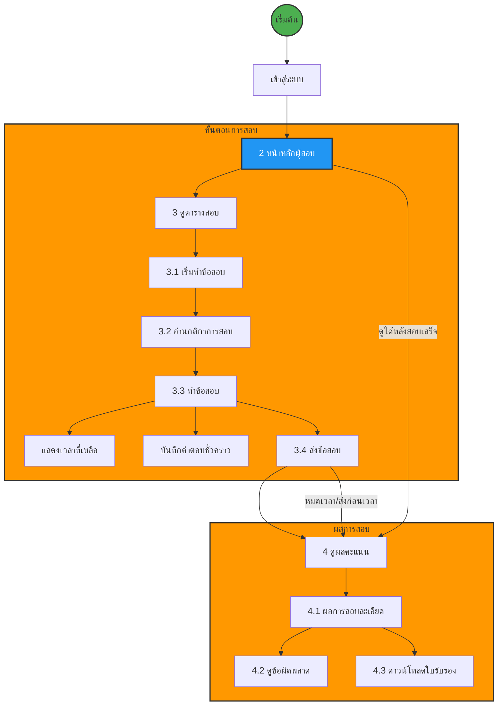

# ระบบจัดการและจัดเก็บผลข้อสอบ

---

## บทบาทแอดมิน

### ระบบจัดการข้อสอบ

ขั้นตอนการสร้างข้อสอบตั้งแต่กำหนดข้อมูลจนถึงบันทึก

### ระบบจัดการผู้สอบ

การจัดการข้อมูลผู้สอบและกำหนดตารางสอบ

### ระบบติดตามการสอบ

ตรวจสอบสถานะและความคืบหน้าของการสอบ

### ระบบรายงาน

การสร้างและส่งออกรายงานประเภทต่างๆ

```mermaid
flowchart TB
    Start((เริ่มต้น)) --> Login[เข้าสู่ระบบ Admin]
    Login --> Dashboard[หน้า Dashboard]

    %% ระบบจัดการข้อสอบ
    Dashboard --> CreateExam[1 สร้างข้อสอบใหม่]
    CreateExam --> SetExamInfo[1.1 กำหนดข้อมูลข้อสอบ]
    SetExamInfo --> AddQuestions[1.2 เพิ่มคำถาม]
    AddQuestions --> SetAnswers[1.3 กำหนดคำตอบ]
    SetAnswers --> SetScoring[1.4 กำหนดเกณฑ์คะแนน]
    SetScoring --> SaveExam[1.5 บันทึกข้อสอบ]

    %% ระบบจัดการผู้สอบ
    SaveExam --> ManageCandidate[2 จัดการผู้สอบ]
    ManageCandidate --> AddCandidate[2.1 เพิ่มผู้สอบ]
    AddCandidate --> EditCandidate[2.2 แก้ไขข้อมูลผู้สอบ]
    EditCandidate --> AssignExam[2.3 กำหนดข้อสอบ]
    AssignExam --> SetSchedule[2.4 กำหนดตารางสอบ]

    %% ระบบติดตามการสอบ
    SetSchedule --> ExamMonitor[3 ติดตามการสอบ]
    ExamMonitor --> ActiveExams[3.1 ข้อสอบที่กำลังสอบ]
    ActiveExams --> CheckProgress[3.2 ตรวจสอบความคืบหน้า]
    CheckProgress --> ViewStatus[3.3 ดูสถานะการสอบ]

    %% ระบบรายงาน
    ViewStatus --> Reports[4 จัดการรายงาน]
    Reports --> ScoreReport[4.1 รายงานคะแนน]
    ScoreReport --> ProgressReport[4.2 รายงานความก้าวหน้า]
    ProgressReport --> StatReport[4.3 รายงานสถิติ]

    StatReport --> ExportReport[4.4 ส่งออกรายงาน]
    ExportReport --> ExportType{ประเภทการส่งออก}
    ExportType --> PDF[PDF]
    ExportType --> Excel[Excel]

    %% สไตล์
    style Start fill:#4CAF50,stroke:#333,stroke-width:2px
    style Dashboard fill:#2196F3,stroke:#333,stroke-width:2px,color:white
    style ExportType fill:#FF9800,stroke:#333,stroke-width:2px

    %% หัวข้อหลัก
    style CreateExam fill:#FFB74D,stroke:#333,stroke-width:2px
    style ManageCandidate fill:#FFB74D,stroke:#333,stroke-width:2px
    style ExamMonitor fill:#FFB74D,stroke:#333,stroke-width:2px
    style Reports fill:#FFB74D,stroke:#333,stroke-width:2px
```

---

## บทบาทผู้สอบ

### เข้าสู่ระบบ

ใช้ข้อมูลล็อกอินที่ได้รับจากแอดมิน

### หน้าหลักผู้สอบ

แสดงข้อมูลและเมนูสำหรับผู้สอบ

### ขั้นตอนการสอบ

-   ดูตารางสอบที่ถูกกำหนดไว้
-   อ่านกติกาก่อนเริ่มสอบ
-   ทำข้อสอบ (มีการแสดงเวลา)
-   ส่งข้อสอบ

### การดูผลสอบ

-   ตรวจสอบข้อผิดพลาด
-   ดูคะแนนและผลการสอบโดยละเอียด
-   ดาวน์โหลดใบรับรอง

